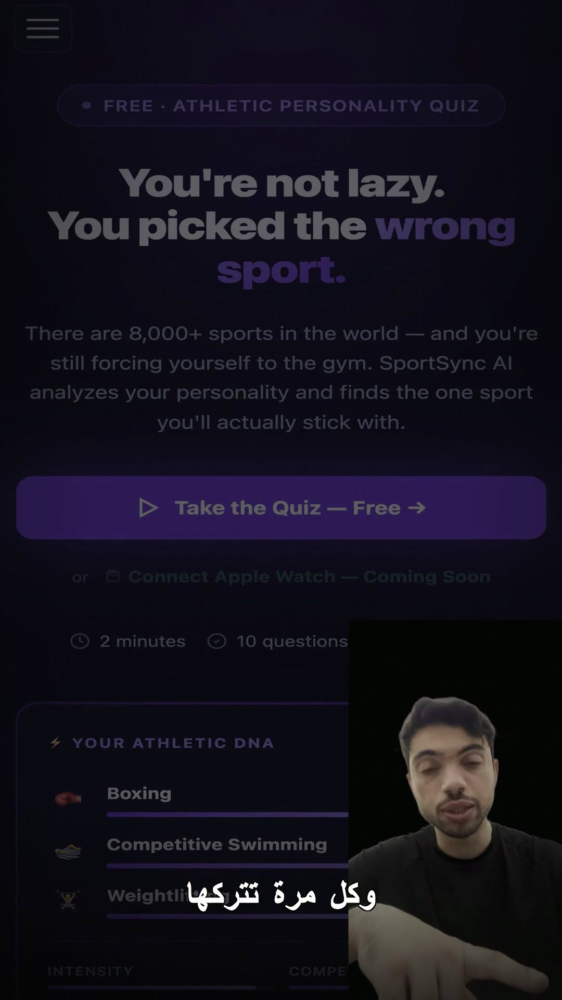

# Personal Brand Video Engine

> Automated short-form video production pipeline. Record once — AI segments the footage, removes background, generates captions, and renders 7 different shot styles as a final MP4.

---

## The Problem

Creating professional short-form content (TikTok, Reels, Shorts) manually means hours of editing per video: cutting clips, removing backgrounds, adding captions, choosing transitions, compositing B-roll. Most creators either spend too long editing or skip the quality entirely.

---

## The Solution

A fully automated pipeline built on [Remotion](https://www.remotion.dev/) (React-based programmatic video). You record once — the system transcribes, analyzes, picks shot sequences, removes background, syncs Arabic captions word-by-word, and exports a finished MP4.

---

## Demo



> _Website overlay + body cutout + Arabic word-by-word captions — all composited in one render_

**Add your screen recording here:** drag an MP4 into a GitHub issue or PR to get a hosted URL, then paste it into this README.

---

## How It Works

```
Record raw video (talking head, 1080x1920, 30fps)
        ↓
rembg (u2netp model) removes background frame-by-frame
  → Exports body_cutout.webm (VP8 alpha, transparency preserved)
        ↓
Whisper large-v3 transcribes audio
  → Extracts word-level timestamps → captions.json (Arabic Gulf dialect)
        ↓
AI Video Director (Claude API)
  reads transcript → picks shot style per segment → writes shot_plan.json
        ↓
Remotion renders final video
  → Reads shot_plan.json → applies 7 styles dynamically → H.264 MP4
```

---

## 7 Shot Styles

| Style | What it does |
|---|---|
| `talking_head` | Full-screen source video with vignette |
| `broll_fullscreen` | B-roll fills screen with dark overlay |
| `pip` | B-roll background + body cutout bottom-right |
| `text_cards` | 3-card sequence with animated accent lines |
| `website_overlay` | Website slides in, body shrinks to side |
| `stat_callout` | Big stat number with spring bounce animation |
| `cta_closer` | CTA pill with pulsing glow + URL typewriter effect |

All styles are driven by a single `shot_plan.json` — no manual editing required.

---

## Screenshots / Output

| Pipeline output |
|---|
|  |
| Website overlay + body cutout (rembg u2netp) + Arabic captions (Whisper large-v3) |

---

## Key Features

| Feature | Details |
|---|---|
| AI Background Removal | rembg (u2netp model) — frame-by-frame, outputs VP8 alpha WebM |
| Arabic Captions | Whisper large-v3, Gulf dialect, word-level timestamps, RTL rendering |
| AI Shot Selection | Claude reads transcript → picks shot sequence → writes shot_plan.json |
| B-Roll Grabber | `grab_broll.py` — paste any URL → downloads portrait MP4 → updates shot plan |
| Template System | CapCut-style templates: list, save, apply, preview shot plans |
| Style Testing | `test_all_styles.py` — renders one still per style for QA |
| Script Agent | AI script generator → `current_script.json` |

---

## Project Structure

```
personal-brand/
├── src/
│   ├── SmartEdit.tsx          ← Main composition: reads shot_plan.json, renders all styles
│   ├── Root.tsx               ← Remotion registry
│   └── styles/
│       ├── TalkingHead.tsx
│       ├── BrollFullscreen.tsx
│       ├── PiP.tsx            ← Body cutout composited over B-roll
│       ├── TextCards.tsx
│       ├── WebsiteOverlay.tsx
│       ├── StatCallout.tsx
│       └── CtaCloser.tsx
├── bin/
│   ├── ai_video_director.py   ← Full pipeline: video → transcribe → AI → render
│   ├── grab_broll.py          ← Download B-roll from any URL
│   ├── remove_bg.py           ← rembg background removal
│   ├── script_agent.py        ← AI script generator
│   ├── templates.py           ← Shot plan template toolkit
│   └── test_all_styles.py     ← QA: one still per style
└── public/
    ├── shot_plan.json         ← Active shot plan (drives render)
    ├── captions.json          ← Word-level timestamps from Whisper
    ├── body_cutout.webm       ← VP8 alpha body cutout
    └── [broll_*.mp4]          ← B-roll library
```

---

## Tech Stack

| Layer | Technologies |
|---|---|
| Video Rendering | Remotion (React + TypeScript) |
| Background Removal | rembg (u2netp model), PyTorch |
| Speech-to-Text | Whisper large-v3 (OpenAI) |
| AI Direction | Claude API (Sonnet) |
| Video Processing | ffmpeg, PIL/OpenCV |
| Captions | @remotion/captions (RTL Arabic) |
| Export | H.264 MP4, yuv420p (max compatibility) |

---

## Biggest Challenge

**Arabic captions in a React video renderer.**

Whisper gives word-level timestamps, but Arabic is RTL and most caption libraries assume LTR. The fix was using `@remotion/captions` with explicit RTL direction and Gulf-dialect Whisper model fine-tuning — rendering each word sequentially right-to-left in sync with audio.

A second challenge: rembg's default `u2net` model struggled with dark backgrounds and fast movement. Switching to `u2netp` (portrait-optimized) improved cutout quality significantly — especially around hair and shoulders.

---

## Setup

```bash
# Install dependencies
npm install
pip install -r requirements.txt

# Run full pipeline (video → finished MP4)
python3 bin/ai_video_director.py public/clip_clean.mp4

# Or run individual steps:
python3 bin/remove_bg.py public/clip_clean.mp4       # Background removal
npx remotion render SmartEdit out/final.mp4           # Render

# Preview in browser
npx remotion preview
```

---

## Result

- Finished MP4 rendered from a 30-second raw clip in ~8 minutes
- Background removed, Arabic captions synced, 7 shot styles composited
- Reusable pipeline — new video = update `shot_plan.json` + re-render
